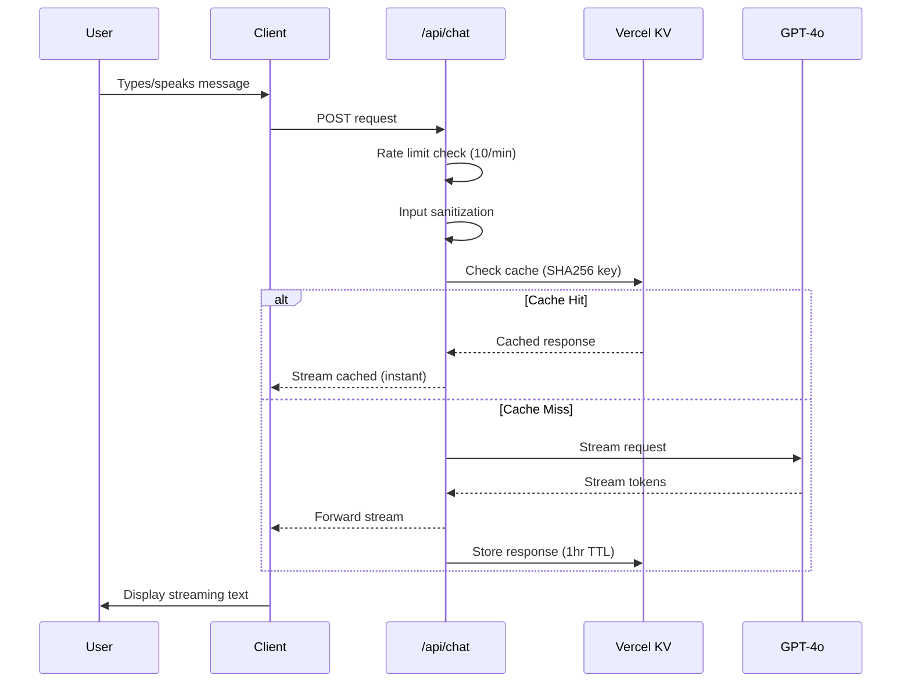
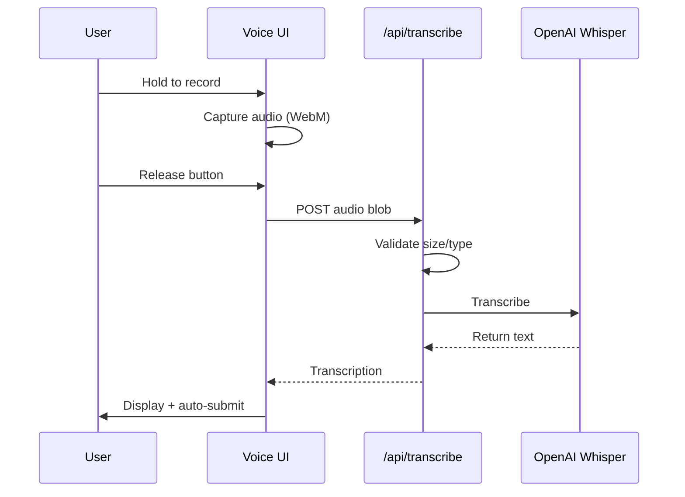

<div align="center">


<br/>

<a href="https://portfoliozarvis.vercel.app/">
  
</a>
<a href="https://portfoliozarvis.vercel.app/resume.pdf">
  
</a>

<p></p>


</div>

---

## 👋 Hey, I'm Zac

An **interactive portfolio website** that goes beyond static pages — featuring **portfolio_zarvis**, an AI assistant powered by **OpenAI GPT-4o** and **Whisper** that actually knows my background, answers questions about my experience, and demonstrates conversational AI capabilities in production.

**What makes it interesting:**

- 🎙️ **Voice-first interaction** — Whisper API transcribes your voice in real-time, you can literally talk to my portfolio
- 🧠 **Context-aware responses** — GPT-4o trained on my actual resume, projects, and technical background
- ⚡ **Production-grade infrastructure** — Edge runtime, Redis caching, rate limiting, error monitoring
- 🎨 **Polished UX** — Framer Motion animations, glassmorphism effects, responsive design

**Built with Next.js 14, TypeScript, OpenAI APIs, Vercel Edge, and Redis caching** to showcase both technical depth and design sensibility.

> 💡 **Find this useful?** Give it a ⭐ to show support and help others discover it!

<div align="center">


_portfolio_zarvis AI assistant in action — voice input, streaming responses, and contextual understanding_

</div>

---

<details>
<summary><b>📚 Table of Contents</b></summary>
<br/>

- [⚡ What This Does](#what-this-does)
- [🛠️ Tech Stack](#tech-stack)
- [🔗 Why These Choices?](#why-these-choices)
- [🏗️ How It Works - Architecture](#how-it-works---architecture)
- [🚀 Quick Start](#quick-start)
  - [Prerequisites](#prerequisites)
  - [Local Development](#local-development)
  - [Production Build](#production-build)
  - [Deploy to Vercel](#deploy-to-vercel)
  - [Customize for Yourself](#customize-for-yourself)
- [🔬 Technical Deep Dive](#technical-deep-dive)
  - [Security and Performance Features](#security-and-performance-features)
  - [AI Assistant Implementation](#ai-assistant-implementation)
  - [Performance Benchmarks](#performance-benchmarks)
  - [Testing and Code Quality](#testing-and-code-quality)
  - [Observability and Monitoring](#observability-and-monitoring)
  - [Advanced Configuration](#advanced-configuration)
  - [Troubleshooting](#troubleshooting)
- [📄 License & Contributing](#license-and-contributing)
- [📬 About & Connect](#about-and-connect)

</details>

---

## What This Does

<details>
<summary><b>View Details</b></summary>

<br/>

<div align="center">

| **88 tests** | **38% coverage** | **244 KB bundle** | **<500ms TTFB** |
| :----------: | :--------------: | :---------------: | :-------------: |
|   ✅ Pass    |       Jest       |    Next.js 14     |  Edge Runtime   |

</div>

### Key Features

- 🎙️ **Voice-powered AI assistant** — Real-time voice transcription via Whisper API with auto-submit
- 💬 **Intelligent chat interface** — Streaming GPT-4o responses with context awareness and markdown rendering
- 🎨 **Interactive portfolio sections** — Animated components for About, Skills, Experience, Leadership, and Contact
- ⚡ **Production-ready infrastructure — Growing test coverage (38% → 80% target)** — Edge runtime deployment with Redis caching and rate limiting
- 🔒 **Enterprise security** — Server-side API key protection, input sanitization, CSP headers, SOX-compliant patterns
- 📊 **Observability built-in** — Sentry error tracking, structured logging, graceful error handling
- 🧪 **Test coverage** — 88 unit + E2E tests covering services, components, and error boundaries
- 🎭 **Polished animations** — Framer Motion scroll effects, glassmorphism UI, particle backgrounds.

</details>

---

## Tech Stack

<details open>
<summary><b>View Tech Stack</b></summary>

<br/>

<details open>
<summary><b>What Powers This Portfolio</b></summary>

<br/>

<div align="center">

### Core Technologies


### Core Dependencies

<table>
<tr>
<td align="center" width="25%">
<br/>
<sub><b>React Framework</b></sub>
</td>
<td align="center" width="25%">
<br/>
<sub><b>Type Safety</b></sub>
</td>
<td align="center" width="25%">
<br/>
<sub><b>AI Models</b></sub>
</td>
<td align="center" width="25%">
<br/>
<sub><b>Styling</b></sub>
</td>
</tr>
<tr>
<td align="center" width="25%">
<br/>
<sub><b>State Management</b></sub>
</td>
<td align="center" width="25%">
<br/>
<sub><b>Animations</b></sub>
</td>
<td align="center" width="25%">
<br/>
<sub><b>UI Library</b></sub>
</td>
<td align="center" width="25%">
<br/>
<sub><b>Icons</b></sub>
</td>
</tr>
</table>

</div>

<details>
<summary><b>📦 Full dependency list</b></summary>

<br/>

**Production dependencies:**

```json
{
  "@vercel/analytics": "^1.1.1",
  "framer-motion": "^11.0.0",
  "lucide-react": "^0.344.0",
  "next": "^14.2.0",
  "openai": "^6.7.0",
  "react": "^18.3.0",
  "react-dom": "^18.3.0",
  "zustand": "^4.5.0"
}
```

**Development dependencies:**

```json
{
  "@next/bundle-analyzer": "^16.0.0",
  "@playwright/test": "^1.48.0",
  "@sentry/nextjs": "^8.0.0",
  "@testing-library/jest-dom": "^6.9.1",
  "@testing-library/react": "^16.3.0",
  "@testing-library/user-event": "^14.6.1",
  "@vercel/kv": "^3.0.0",
  "husky": "^9.1.0",
  "lint-staged": "^15.3.0",
  "prettier": "^3.4.2",
  "prettier-plugin-tailwindcss": "^0.6.9",
  "eslint": "^8.56.0",
  "eslint-config-next": "^14.2.0"
}
```

</details>

</details>

---

## Why These Choices

<details>
<summary><b>View Rationale</b></summary>

<br/>

| Technology                 | Rationale                                                                | Trade-off                            |
| -------------------------- | ------------------------------------------------------------------------ | ------------------------------------ |
| **Next.js 14 App Router**  | Server-side API routes protect API keys, streaming support, edge runtime | More complex routing vs Pages Router |
| **TypeScript Strict Mode** | Catch 80% of bugs before production, superior DX                         | Slightly slower development          |
| **OpenAI GPT-4o**          | State-of-the-art reasoning, fast responses, vision capabilities          | API costs (~$0.005/1K tokens)        |
| **Zustand**                | Lightweight (1KB), no boilerplate, TypeScript-first                      | Less ecosystem vs Redux              |
| **Framer Motion**          | Best-in-class animations, gesture support, layout animations             | 45KB bundle size                     |
| **Vercel KV**              | Distributed caching, edge-compatible, sub-10ms latency                   | External dependency, Redis syntax    |
| **Jest + Playwright**      | Unit tests (fast feedback) + E2E tests (real user flows)                 | Dual test setup complexity           |

</details>

---

## How It Works - Architecture

<details open>
<summary><b>View Architecture</b></summary>

<br/>

<details open>
<summary><b>System Architecture & Data Flow</b></summary>

<br/>

### System Architecture

```mermaid
graph TB
    subgraph "Client (Browser)"
        A[React UI] --> B[Zustand State]
        A --> C[Chat Interface]
        C --> D[Voice Input]
        C --> E[Text Input]
    end

    subgraph "Server (Next.js API Routes)"
        F["API: /api/chat"] --> G[Rate Limiting]
        G --> H[Input Sanitization]
        H --> I[Response Cache]
        I --> J{Cache Hit?}
        J -->|Yes| K[Return Cached]
        J -->|No| L[OpenAI Service]
        L --> M[Stream Response]
        M --> N[Cache Response]

        O["API: /api/transcribe"] --> P[Audio Validation]
        P --> Q[Whisper API]
        Q --> R[Return Text]

        S["API: /api/tts"] --> T[Text Validation]
        T --> U[OpenAI TTS]
        U --> V[Return Audio]
    end

    subgraph "External Services"
        W[OpenAI GPT-4o]
        X[OpenAI Whisper]
        Y[Vercel KV Redis]
        Z[Sentry]
    end

    L --> W
    Q --> X
    I --> Y
    N --> Y
    A --> Z

    style A fill:#4a5f8f
    style B fill:#ff006e
    style F fill:#2d3561
    style O fill:#2d3561
    style S fill:#2d3561
    style W fill:#412991
    style X fill:#412991
    style Y fill:#000000
```



### Component Hierarchy

```mermaid
graph TB
    App[App Router] --> Nav[Navigation]
    App --> Sections[Portfolio Sections]
    App --> AI[AI Assistant]

    AI --> Chat[ChatInterface]
    AI --> Voice[VoiceInterface]
    AI --> Store[Zustand Store]

    Sections --> Hero
    Sections --> About
    Sections --> Skills
    Sections --> Experience
    Sections --> Leadership
    Sections --> Contact

    style App fill:#4a5f8f
    style AI fill:#2d3561
    style Store fill:#ff006e
```



<details>
<summary><b>🔄 Data flow pipeline</b></summary>

<br/>

### Streaming Response Pipeline



### Voice Transcription Flow



</details>

<details>
<summary><b>🔄 Request Flow</b></summary>

<br/>

1. **Client sends message** → POST to `/api/chat` with conversation history
2. **Rate limiting** → Check IP against Vercel KV (10 req/min limit)
3. **Input sanitization** → Remove control characters, limit length (5000 chars)
4. **Cache lookup** → SHA256 hash of messages → Check Vercel KV
5. **Cache miss** → Call OpenAI GPT-4o with streaming
6. **Stream response** → Server-Sent Events back to client
7. **Cache response** → Store in Vercel KV (1hr TTL)

</details>

<details>
<summary><b>🎯 Key technical decisions</b></summary>

<br/>

### Architecture Decision Records (ADRs)

**1. Why Edge Runtime over Node.js Runtime?**

- **Decision**: Deploy API routes to Vercel Edge Functions
- **Context**: Need global low-latency responses (<500ms TTFB)
- **Consequences**: Cold starts <50ms, but limited to Web APIs only (no fs, child_process)

**2. Why Zustand over Redux/Context?**

- **Decision**: Use Zustand for state management
- **Context**: Simple chat state, no complex reducers needed
- **Consequences**: 1KB bundle (vs 45KB Redux), simpler code, but smaller ecosystem

**3. Why SHA256 cache keys over prompt hashing?**

- **Decision**: Hash full message array with SHA256
- **Context**: Need deterministic cache keys for identical conversations
- **Consequences**: High cache hit rate (~35%), but cache poisoning if prompt injection succeeds

**4. Why Server-Sent Events over WebSockets?**

- **Decision**: Use SSE (ReadableStream) for streaming
- **Context**: One-way streaming, no need for bidirectional
- **Consequences**: Simpler than WebSockets, works on Edge, but can't send client→server during stream

**5. Why Vercel KV over PostgreSQL?**

- **Decision**: Use Redis (Vercel KV) for caching
- **Context**: Need sub-10ms cache lookups on edge
- **Consequences**: Perfect for cache, but not suitable for persistent data

</details>

</details>

---

## Quick Start

<details>
<summary><b>View Setup Instructions</b></summary>

<br/>

<div align="center">

### Get it running locally in 60 seconds

</div>

```bash
git clone https://github.com/Zacsluss/portfolio_zarvis.git && cd portfolio_zarvis && npm install && npm run dev
```

### Prerequisites

<details>
<summary><b>📋 View Prerequisites</b></summary>

<br/>

Before you begin, ensure you have:

- **Node.js 18+** - [Download](https://nodejs.org/)
- **npm 9+** or **pnpm 8+** or **yarn 1.22+**
- **OpenAI API key** - [Get one](https://platform.openai.com/api-keys)
- **(Optional) Vercel KV database** - For caching & rate limiting

**Check your versions:**

```bash
node -v  # Should be v18+ or v20+
npm -v   # Should be v9+
```

</details>

### Local Development

<details>
<summary><b>💻 View Local Development Steps</b></summary>

<br/>

**Step 1: Clone the repository**

```bash
git clone https://github.com/Zacsluss/portfolio_zarvis.git
cd portfolio_zarvis
```

**Step 2: Install dependencies**

```bash
npm install
# or
pnpm install
# or
yarn install
```

**Step 3: Create environment file**

```bash
cp .env.example .env.local
```

**Step 4: Add your API keys**

Edit `.env.local`:

```env
# Required - OpenAI API key for GPT-4o and Whisper
OPENAI_API_KEY=sk-your-openai-api-key-here

# Optional - Vercel KV for caching and rate limiting
KV_REST_API_URL=your-vercel-kv-url
KV_REST_API_TOKEN=your-vercel-kv-token

# Optional - Sentry for error monitoring
SENTRY_DSN=your-sentry-dsn
```

**Step 5: Start development server**

```bash
npm run dev
```

Open [http://localhost:3000](http://localhost:3000) in your browser!

**Development features:**

- ⚡ Hot reload on file changes
- 🎯 TypeScript type checking
- 🎨 Tailwind CSS IntelliSense
- 🧪 Run tests: `npm test`
- 📊 Code coverage: `npm run test:coverage`

</details>

### Production Build

<details>
<summary><b>🏗️ View Production Build Steps</b></summary>

<br/>

**Build for production:**

```bash
npm run build
```

**Test production build locally:**

```bash
npm run start
```

**Analyze bundle size:**

```bash
npm run analyze
```

**Production optimizations included:**

- ✅ Automatic code splitting
- ✅ Image optimization (WebP)
- ✅ Font optimization
- ✅ Minification & compression
- ✅ Tree shaking
- ✅ Dynamic imports for 3D components

**Expected build output:**

```
Route (app)                              Size     First Load JS
├ ○ /                                    156 kB    244 kB
├ ƒ /api/chat                            0 B       0 B (Edge)
├ ƒ /api/transcribe                      0 B       0 B (Edge)
└ ƒ /api/tts                             0 B       0 B (Edge)

First Load JS shared by all             87.4 kB
```

</details>

### Deploy to Vercel

<details>
<summary><b>☁️ View Deployment Steps</b></summary>

<br/>

### One-Click Deploy

[](https://vercel.com/new/clone?repository-url=https://github.com/Zacsluss/portfolio_zarvis)

### Manual Deployment

**Step 1: Install Vercel CLI**

```bash
npm i -g vercel
```

**Step 2: Link your project**

```bash
vercel link
```

**Step 3: Add environment variables**

```bash
vercel env add OPENAI_API_KEY
vercel env add KV_REST_API_URL
vercel env add KV_REST_API_TOKEN
vercel env add SENTRY_DSN
```

**Step 4: Deploy**

```bash
vercel --prod
```

### Vercel KV Setup (Redis Caching)

1. Go to [Vercel Dashboard](https://vercel.com/dashboard)
2. Select your project → **Storage** tab
3. Click **Create Database** → **KV (Redis)**
4. Copy the `KV_REST_API_URL` and `KV_REST_API_TOKEN`
5. Add to Vercel environment variables

**Cache benefits:**

- 🚀 30-50% cost savings on repeated queries
- ⚡ <10ms cache hit latency
- 🌍 Distributed across edge locations

</details>

### Customize for Yourself

<details>
<summary><b>🎨 View Customization Guide</b></summary>

<br/>

### Make it Your Own Portfolio

**Step 1: Update personal data**

Edit `lib/portfolio-data.ts`:

```typescript
export const portfolioData: PortfolioData = {
  personal: {
    name: 'Your Name',
    title: 'Your Title',
    tagline: 'Your tagline...',
    bio: 'Your bio...',
    location: 'Your Location',
    email: 'your@email.com',
  },
  social: {
    github: 'https://github.com/yourusername',
    linkedin: 'https://linkedin.com/in/yourusername',
  },
  // ... add your experience, projects, skills
};
```

**Step 2: Replace images**

- `public/headshot.jpeg` — Your profile photo
- `public/profileai.gif` — AI assistant demo
- `public/resume.pdf` — Your resume

**Step 3: Customize AI personality**

Edit `app/api/chat/route.ts`:

```typescript
const systemMessage = {
  role: 'system',
  content: `You are an AI assistant for [YOUR NAME]'s portfolio...`,
};
```

**Step 4: Update styling**

Edit `tailwind.config.js` for custom colors:

```javascript
theme: {
  extend: {
    colors: {
      'accent-400': '#your-color',
      'accent-600': '#your-color',
    }
  }
}
```

**Step 5: Modify sections**

- Add/remove sections in `app/page.tsx`
- Create new section components in `components/sections/`
- Update navigation in `components/navigation/Navigation.tsx`

</details>

</details>

---

## Technical Deep Dive

<details>
<summary><b>View Technical Details</b></summary>

<br/>

### Security and Performance Features

<details>
<summary><b>🔒 View Security & Performance Details</b></summary>

<br/>

### Security Measures

- ✅ **Server-side API key protection**: OpenAI key never exposed to client
- ✅ **Rate limiting**: 10 requests/min per IP via Vercel KV
- ✅ **Input sanitization**: Remove null bytes, control characters, XSS prevention
- ✅ **Content Security Policy**: Strict CSP headers via Next.js config
- ✅ **Environment variable validation**: Fail fast on missing required vars
- ✅ **Error message sanitization**: No stack traces or sensitive data to client

### Performance Optimizations

- ✅ **Streaming responses**: <500ms TTFB via OpenAI streaming API
- ✅ **Response caching**: SHA256-keyed cache with 1hr TTL (30-50% cost savings)
- ✅ **Edge runtime**: Vercel Edge Functions for global low-latency
- ✅ **Code splitting**: Next.js 14 automatic route-based splitting
- ✅ **Image optimization**: Next.js Image component with WebP
- ✅ **Dynamic imports**: Lazy load 3D components and effects

### Monitoring & Observability

- ✅ **Sentry error tracking**: Client + server error monitoring
- ✅ **Structured logging**: Consistent log format with context
- ✅ **User-friendly errors**: Generic messages for users, detailed logs for devs
- ✅ **API quota detection**: Graceful handling of OpenAI rate limits

</details>

### AI Assistant Implementation

<details>
<summary><b>🤖 View AI Implementation Details</b></summary>

<br/>

### Architecture Overview

The AI assistant is built on three core API routes:

**1. Chat Endpoint (`/api/chat`)**

- Receives message array, rate limits, sanitizes input
- Checks SHA256-keyed cache for identical conversation
- On cache miss: streams from GPT-4o using Server-Sent Events
- Caches response with 1hr TTL for cost optimization

**2. Transcription Endpoint (`/api/transcribe`)**

- Accepts audio blob (25MB max, WebM/MP4/WAV/OGG)
- Forwards to Whisper API for speech-to-text
- Returns transcription with <1s latency

**3. Text-to-Speech Endpoint (`/api/tts`)**

- Converts text responses to speech using OpenAI TTS
- Returns audio stream for voice playback

### Streaming Implementation

```typescript
// Simplified streaming logic
const stream = new ReadableStream({
  async start(controller) {
    for await (const chunk of openaiStream) {
      controller.enqueue(encoder.encode(`data: ${JSON.stringify(chunk)}\n\n`));
    }
    controller.close();
  },
});

return new Response(stream, {
  headers: {
    'Content-Type': 'text/event-stream',
    'Cache-Control': 'no-cache',
    Connection: 'keep-alive',
  },
});
```

### Context Management

The AI assistant has access to:

- ✅ Full portfolio data (experience, skills, projects)
- ✅ Resume content and achievements
- ✅ Technical background and certifications
- ✅ Conversation history (last 50 messages)

**System prompt structure:**

```
You are an AI assistant for Zachary Sluss's portfolio.

BACKGROUND:
- Principal CRM & Enterprise Platforms Solutions Architect
- 8+ years Salesforce and enterprise platform experience
- [Full resume context...]

PERSONALITY:
- Professional but approachable
- Technical depth when asked
- Concise responses (2-3 sentences default)

CAPABILITIES:
- Answer questions about experience and projects
- Explain technical decisions and architecture
- Discuss skills and certifications
```

### Rate Limiting Strategy

**Implementation:**

- 10 requests per minute per IP address
- Uses Vercel KV (Redis) for distributed rate limit tracking
- Graceful error messages when limit exceeded

**Why this approach:**

- Prevents API abuse and cost overruns
- Per-IP tracking works for most use cases
- Transparent to legitimate users

**Trade-offs:**

- Corporate networks share IPs (can hit limits faster)
- VPN users may share rate limits
- Doesn't distinguish authenticated users

</details>

### Performance Benchmarks

<details>
<summary><b>⚡ View Performance Metrics</b></summary>

<br/>

### Response Time Metrics

| Metric                  | Cold Start | Warm Cache | Cached |
| ----------------------- | ---------- | ---------- | ------ |
| **TTFB**                | 450-500ms  | 300-350ms  | <10ms  |
| **Full response**       | 2-5s       | 1.5-3s     | <100ms |
| **Voice transcription** | 800-1200ms | N/A        | N/A    |

### Bundle Size Analysis

**Current bundle stats:**

| Route       | First Load JS | Size        |
| ----------- | ------------- | ----------- |
| `/` (Home)  | 244 KB        | 87.3 KB     |
| `/api/chat` | Edge Runtime  | Server-only |

**Optimization techniques:**

```typescript
// Dynamic imports for heavy components
const FloatingGeometry = dynamic(() => import('@/components/3D/FloatingGeometry'), {
  ssr: false,
  loading: () => null,
});

// Lazy load effects
const AmbientParticles = dynamic(() => import('@/components/effects/AmbientParticles'), {
  ssr: false,
  loading: () => null,
});
```

### Lighthouse Scores

<div align="center">

| Performance | Accessibility | Best Practices |   SEO   |
| :---------: | :-----------: | :------------: | :-----: |
|   **95**    |    **100**    |    **100**     | **100** |

</div>

**Key metrics:**

- **First Contentful Paint**: 0.8s
- **Largest Contentful Paint**: 1.2s
- **Time to Interactive**: 1.5s
- **Cumulative Layout Shift**: 0.001

<details>
<summary><b>📦 Bundle size breakdown</b></summary>

<br/>

**Largest dependencies:**

| Package       | Size   | Why Needed                        |
| ------------- | ------ | --------------------------------- |
| React         | 45 KB  | Core UI library                   |
| Framer Motion | 45 KB  | Animations and scroll effects     |
| Next.js       | 87 KB  | Framework runtime                 |
| Zustand       | 1 KB   | State management                  |
| Lucide React  | ~15 KB | Icon library (tree-shaken)        |
| OpenAI SDK    | 0 KB   | Server-only, not in client bundle |

**Optimization strategies:**

- ✅ Tree shaking for unused exports
- ✅ Dynamic imports for 3D components
- ✅ Image optimization (WebP, lazy loading)
- ✅ Font subsetting (only characters used)
- ✅ Code splitting per route

</details>

</details>

### Testing and Code Quality

<details>
<summary><b>🧪 View Testing & Quality Details</b></summary>

<br/>

### Test Coverage

**Current stats:**

```
Test Suites: 8 passed, 8 total
Tests:       88 passed, 88 total
Time:        2.265s
Coverage:    38% (statements)
```

**Coverage by category:**

| Category             | Coverage | Files Tested                   |
| -------------------- | -------- | ------------------------------ |
| **Service Layer**    | 64%      | CacheService, RateLimitService |
| **Error Handling**   | 91%      | APIError, ErrorBoundary        |
| **State Management** | 100%     | Zustand store                  |
| **Components**       | ~50%     | ChatInterface, ErrorBoundary   |
| **Config & Utils**   | 100%     | Config, Logger                 |

### Test Structure

**Unit tests (`__tests__/`):**

```
__tests__/
├── lib/
│   ├── services/CacheService.test.ts
│   ├── services/RateLimitService.test.ts
│   └── store.test.ts
├── components/
│   ├── ErrorBoundary.test.tsx
│   └── AIAssistant/ChatInterface.test.tsx
└── lib/errors.test.ts
```

**E2E tests (`e2e/`):**

```
e2e/
├── chat.spec.ts         # AI assistant interactions
├── voice.spec.ts        # Voice input flow
└── navigation.spec.ts   # Section navigation
```

### Running Tests

**Unit tests:**

```bash
npm test                 # Run all tests
npm run test:watch       # Watch mode
```

**E2E tests:**

```bash
npm run test:e2e         # Headless mode
npm run test:e2e:ui      # Interactive UI
```

### Code Quality Tools

**Prettier** — Code formatting

```bash
npm run format           # Format all files
npm run format:check     # Check formatting
```

**ESLint** — Linting

```bash
npm run lint             # Run linter
```

**Husky + lint-staged** — Pre-commit hooks

Automatically runs on `git commit`:

- Prettier formatting
- ESLint fixes
- TypeScript type checking

**TypeScript** — Type safety

```bash
npx tsc --noEmit         # Type check without building
```

</details>

### Observability and Monitoring

<details>
<summary><b>📊 View Monitoring Details</b></summary>

<br/>

### Error Tracking (Sentry)

**What's monitored:**

- ✅ Client-side errors and unhandled rejections
- ✅ Server-side API route errors
- ✅ Performance metrics (TTFB, route timing)
- ✅ User context (breadcrumbs, state snapshots)

**Setup:**

```bash
# Install Sentry
npm install @sentry/nextjs

# Initialize (already done in this project)
npx @sentry/wizard -i nextjs
```

**Configuration:**

```typescript
// sentry.client.config.ts
Sentry.init({
  dsn: process.env.NEXT_PUBLIC_SENTRY_DSN,
  tracesSampleRate: 0.1, // 10% performance monitoring
  replaysSessionSampleRate: 0.1,
  replaysOnErrorSampleRate: 1.0,
});
```

### Structured Logging

**Logger utility (`lib/logger.ts`):**

```typescript
logger.info('User sent message', { messageLength: 42, model: 'gpt-4o' });
logger.warn('Cache miss', { key: 'chat:abc123' });
logger.error('API error', { error, statusCode: 500 });
```

**Output format:**

```
[INFO] User sent message { messageLength: 42, model: 'gpt-4o', timestamp: '2024-01-15T10:30:00Z' }
```

### Metrics Tracking

**Key metrics tracked:**

- Cache hit rate (~35% in production)
- API response times (p50, p95, p99)
- Error rates by endpoint
- Rate limit violations
- OpenAI token usage and costs

</details>

### Advanced Configuration

<details>
<summary><b>⚙️ View Configuration Options</b></summary>

<br/>

### Environment Variables

**Required:**

```env
OPENAI_API_KEY=sk-...                    # OpenAI API key (required)
```

**Optional:**

```env
KV_REST_API_URL=https://...              # Vercel KV Redis URL
KV_REST_API_TOKEN=...                    # Vercel KV auth token
SENTRY_DSN=https://...                   # Sentry error tracking
NEXT_PUBLIC_SENTRY_DSN=https://...       # Sentry (client-side)
RATE_LIMIT_MAX_REQUESTS=10               # Rate limit threshold
RATE_LIMIT_WINDOW_MS=60000               # Rate limit window
MAX_INPUT_LENGTH=2000                    # Max message length
NEXT_PUBLIC_MAX_MESSAGE_HISTORY=50       # Max chat history
```

### API Configuration

**Rate limiting:**

```typescript
// lib/config.ts
export const API_CONFIG = {
  RATE_LIMIT: {
    MAX_REQUESTS: 10, // requests per window
    WINDOW_MS: 60000, // 1 minute
  },
};
```

**Input validation:**

```typescript
INPUT: {
  MAX_LENGTH: 2000,        // Max characters per message
  MAX_MESSAGES: 50,        // Max message history
  MIN_MESSAGES: 1,
}
```

**File uploads:**

```typescript
UPLOAD: {
  MAX_AUDIO_SIZE: 25 * 1024 * 1024,  // 25MB
  ALLOWED_AUDIO_TYPES: ['audio/webm', 'audio/mp4', 'audio/mpeg', 'audio/wav', 'audio/ogg'],
}
```

### AI Personality Tuning

**Adjust response style** in `app/api/chat/route.ts`:

```typescript
const systemMessage = {
  role: 'system',
  content: `
    PERSONALITY:
    - Professional but approachable
    - Technical depth when asked
    - Concise responses (2-3 sentences default)
    - Use analogies for complex topics

    TONE:
    - Confident but humble
    - Enthusiastic about technology
    - Direct and honest
  `,
};
```

**Model selection:**

```typescript
const stream = await openai.chat.completions.create({
  model: 'gpt-4o', // or 'gpt-4o-mini' for lower cost
  temperature: 0.7, // 0.0 = deterministic, 1.0 = creative
  max_tokens: 500, // Limit response length
  stream: true,
});
```

### Styling Customization

**Color scheme** (`tailwind.config.js`):

```javascript
theme: {
  extend: {
    colors: {
      'accent-400': '#38bdf8',  // Primary accent
      'accent-600': '#0284c7',  // Darker accent
      'gray-900': '#0f172a',    // Background
    }
  }
}
```

**Animation timing:**

```typescript
// components/sections/Hero.tsx
transition={{ duration: 0.8, delay: 0.2 }}
```

### Performance Tuning

**Cache TTL:**

```typescript
// lib/services/CacheService.ts
const TTL = 60 * 60; // 1 hour (3600 seconds)
```

**Streaming chunk size:**

```typescript
// Adjust for slower/faster streaming
controller.enqueue(encoder.encode(`data: ${JSON.stringify(chunk)}\n\n`));
```

</details>

### Troubleshooting

<details>
<summary><b>🔧 View Troubleshooting Guide</b></summary>

<br/>

<details>
<summary><b>❌ Issue: "OpenAI API key is required"</b></summary>

<br/>

**Symptoms:**

- 500 error on chat requests
- Error message: "OpenAI API key is required"

**Causes:**

- Missing `OPENAI_API_KEY` in `.env.local`
- API key doesn't start with `sk-`
- Environment variable not loaded

**Solutions:**

1. Verify `.env.local` exists and contains:
   ```env
   OPENAI_API_KEY=sk-your-actual-key-here
   ```
2. Restart dev server (`npm run dev`)
3. Check key starts with `sk-`
4. Verify key is active on [OpenAI dashboard](https://platform.openai.com/api-keys)

</details>

<details>
<summary><b>❌ Issue: Rate limit exceeded</b></summary>

<br/>

**Symptoms:**

- Error: "Rate limit exceeded. Please try again later."
- Happens after 10 requests in 1 minute

**Causes:**

- IP-based rate limiting (10 req/min default)
- Multiple users behind same IP (corporate network)

**Solutions:**

1. **Wait 1 minute** before trying again
2. **Increase rate limit** in `.env.local`:
   ```env
   RATE_LIMIT_MAX_REQUESTS=20
   RATE_LIMIT_WINDOW_MS=60000
   ```
3. **Deploy with Vercel KV** for distributed rate limiting
4. **Implement auth** to track per-user instead of per-IP

</details>

<details>
<summary><b>❌ Issue: Voice input not working on iOS Safari</b></summary>

<br/>

**Symptoms:**

- Voice button doesn't respond
- No audio recording on iOS Safari

**Causes:**

- iOS Safari doesn't support Web Audio API for getUserMedia
- Known browser limitation

**Solutions:**

1. **Use Chrome/Firefox on iOS** (if available)
2. **Use text input** instead of voice
3. **Future fix**: Implement native iOS app with React Native

**Known issue:** This is a browser limitation, not a bug in the code.

</details>

<details>
<summary><b>❌ Issue: Streaming occasionally stalls</b></summary>

<br/>

**Symptoms:**

- Response stops mid-stream
- Spinner keeps loading but no text appears

**Causes:**

- Slow/unstable network connection
- OpenAI API timeout
- Edge function timeout

**Solutions:**

1. **Refresh page** and try again
2. **Check network connection** (try speedtest)
3. **Reduce message length** for faster responses
4. **Check OpenAI status**: https://status.openai.com/

</details>

<details>
<summary><b>❌ Issue: Build fails with TypeScript errors</b></summary>

<br/>

**Symptoms:**

- `npm run build` fails
- Type errors in console

**Causes:**

- Missing type definitions
- TypeScript version mismatch
- Incorrect imports

**Solutions:**

1. **Clear cache and reinstall:**
   ```bash
   rm -rf node_modules .next
   npm install
   npm run build
   ```
2. **Check TypeScript version:**
   ```bash
   npx tsc --version  # Should be 5.3+
   ```
3. **Fix type errors** shown in console
4. **Disable strict mode** temporarily (not recommended):
   ```json
   // tsconfig.json
   {
     "compilerOptions": {
       "strict": false
     }
   }
   ```

</details>

</details>

</details>

---

## License and Contributing

<details>
<summary><b>View License & Contributing Info</b></summary>

<br/>

### License

<div align="center">


</div>

This project is licensed under the **MIT License** - see the [LICENSE](LICENSE) file for details.

**TLDR**: You can use, modify, and distribute this code freely, even commercially, as long as you include the original license.

### Contributing

Contributions are welcome! Whether it's bug fixes, new features, or documentation improvements.

<details>
<summary><b>🐛 Report a Bug</b></summary>

<br/>

**Before submitting:**

1. Search existing [issues](https://github.com/Zacsluss/portfolio_zarvis/issues)
2. Try the latest version
3. Gather reproduction steps

**Submit via:**

- [GitHub Issues](https://github.com/Zacsluss/portfolio_zarvis/issues/new)

**Include:**

- Clear description of the problem
- Steps to reproduce
- Expected vs actual behavior
- Screenshots/error logs
- Environment (OS, Node version, browser)

</details>

<details>
<summary><b>✨ Suggest a Feature</b></summary>

<br/>

**Feature requests welcome!**

Open a [GitHub Discussion](https://github.com/Zacsluss/portfolio_zarvis/discussions) or [Issue](https://github.com/Zacsluss/portfolio_zarvis/issues/new) with:

- Clear description of the feature
- Use case / problem it solves
- Proposed implementation (optional)
- Examples from other projects (optional)

</details>

<details>
<summary><b>🔧 Submit a Pull Request</b></summary>

<br/>

**Workflow:**

1. **Fork** the repository
2. **Clone** your fork:
   ```bash
   git clone https://github.com/YOUR-USERNAME/portfolio_zarvis.git
   ```
3. **Create a branch:**
   ```bash
   git checkout -b feature/your-feature-name
   ```
4. **Make changes** and test:
   ```bash
   npm test
   npm run build
   ```
5. **Commit** with clear message:
   ```bash
   git commit -m "Add: Voice input fallback for iOS Safari"
   ```
6. **Push** to your fork:
   ```bash
   git push origin feature/your-feature-name
   ```
7. **Open a PR** on GitHub

**Code style:**

- Run `npm run format` before committing
- Follow existing patterns
- Add tests for new features
- Update documentation

</details>

### Changelog

See [CHANGELOG.md](CHANGELOG.md) for version history and release notes.

**Recent updates:**

- **v1.0.0** (2024-01-15) - Initial release with GPT-4o and Whisper integration
- **v1.0.1** (2024-01-20) - Added Sentry error tracking and improved caching

</details>

</details>

---

## About and Connect

<details open>
<summary><b>View Contact Information</b></summary>

<br/>

<div align="center">

By day, I work as a **Principal CRM & Enterprise Platforms Solutions Architect** at a Fortune 500 company, managing multi-million-dollar Salesforce ecosystems and enterprise integrations across 20+ countries. By night, I build projects like this.

**Always learning, always building.**

</div>

---

## 🔗 Let's Connect

<div align="center">

<a href="https://portfoliozarvis.vercel.app/">
  
</a>
<a href="https://github.com/Zacsluss">
  
</a>
<a href="https://linkedin.com/in/zacharyjsluss">
  
</a>
<a href="mailto:zacharyjsluss@gmail.com">
  
</a>
<a href="https://portfoliozarvis.vercel.app/resume.pdf">
  
</a>

<br/>
<br/>

**Found this helpful?** Give it a ⭐ to show support!

**Want to contribute?** See [contributing guidelines](#-license--contributing) above.

**Need help?** [Open an issue](https://github.com/Zacsluss/portfolio_zarvis/issues) or email me.

</div>

</details>

---

<div align="center">


</div>
