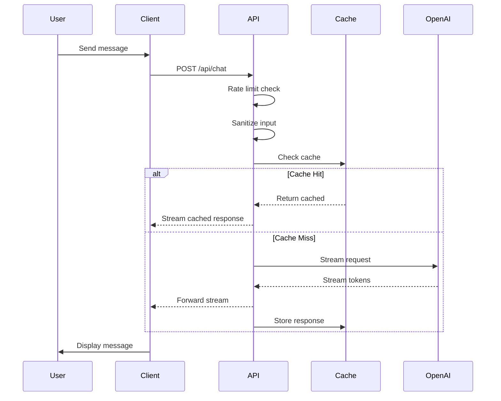

<div align="center">

<!-- Hero Header with Name -->


<br/>

<!-- Animated Typing Subtitle -->


<br/>

<!-- Main Action Buttons -->
<p align="center">
  <a href="https://portfoliozarvis.vercel.app/"></a>
  <a href="https://github.com/Zacsluss/portfolio_zarvis/archive/refs/heads/main.zip"></a>
</p>

<!-- GitHub Stats Badges -->
<p align="center">
  
  
  
  
  
</p>

</div>

<br/>

---

## 👋 Hey, I'm Zac

I built this portfolio with a conversational AI that knows everything about my professional background. Ask it about my experience, projects, or technical expertise — it responds in real-time with **streaming GPT-4o responses**.

**What makes it interesting:**

- 🤖 Trained AI assistant (ZARVIS) with complete career context
- 🎤 Voice input via OpenAI Whisper API
- ⚡ Server-side streaming with <500ms TTFB
- 💰 30-50% API cost reduction through intelligent caching
- 🔒 Rate limiting, error monitoring, and production-ready security

Built with Next.js 14, TypeScript, and OpenAI API!

<div align="center">

<br/>
<i>Real-time conversational AI — ask about my background, projects, or play D&D!</i>
</div>

---

<details>
<summary><b>📚 Table of Contents</b></summary>

<br/>

- [⚡ What This Does](#-what-this-does)
- [🛠️ Tech Stack](#️-tech-stack)
- [🏗️ How It Works / Architecture](#️-how-it-works--architecture)
- [🚀 Quick Start](#-quick-start)
  - [Prerequisites](#prerequisites)
  - [Installation](#installation)
  - [Configuration](#configuration)
  - [Development](#development)
  - [Deployment](#deployment)
- [🔬 Technical Deep Dive](#-technical-deep-dive)
  - [UI Components & State Management](#ui-components--state-management)
  - [AI Assistant Architecture](#ai-assistant-architecture)
  - [Performance Optimization](#performance-optimization)
  - [Testing & Code Quality](#testing--code-quality)
  - [Troubleshooting](#troubleshooting)
  - [Advanced Configuration](#advanced-configuration)
- [📄 License & Contributing](#-license--contributing)
- [📬 About & Connect](#-about--connect)

</details>

---

<details>
<summary><b>⚡ What This Does</b></summary>

<br/>

<div align="center">

**GPT-4o conversational AI** • **Voice input support** • **Streaming responses** • **Production-ready**

</div>

This is an interactive portfolio website featuring **ZARVIS** - an AI assistant trained on my complete professional background. Visitors can have natural conversations about my experience, skills, and projects.

### Key Features

#### 🤖 AI Assistant (ZARVIS)

- **Personality-driven AI**: Conversational, enthusiastic, and genuinely helpful
- **Complete career context**: Trained on 8+ years of CRM/enterprise platform experience
- **Dual modes**: Professional consultant OR Dungeons & Dragons Dungeon Master
- **Real-time streaming**: Instant feedback with <500ms time-to-first-byte
- **Context-aware responses**: Remembers conversation history

#### 🎤 Voice Interface

- **Speech-to-text**: OpenAI Whisper API transcription
- **Real-time processing**: Instant voice message conversion
- **Hands-free interaction**: Click, speak, done

#### ⚡ Performance & Security

- **Response caching**: 30-50% API cost reduction via SHA256-keyed cache
- **Rate limiting**: 10 requests/min per IP (configurable)
- **Input sanitization**: XSS and injection attack prevention
- **Server-side API keys**: Never exposed to client
- **Error monitoring**: Sentry integration for production tracking

#### 🎨 Portfolio Sections

- **Hero**: Animated 3D elements, particle effects, parallax
- **About Me**: Three-column layout with bio, photo, quick facts
- **Skills & Technologies**: 3 categories, 30+ technologies
- **Experience**: Timeline with achievements and tech stacks
- **Leadership & Passions**: Philosophy, metrics, creative work
- **Contact**: Email, phone, social links, resume download

</details>

---

## 🛠️ Tech Stack

<details open>
<summary><b>Core Technologies & Dependencies</b></summary>

<br/>

<div align="center">

### Core Technologies


### Dependencies Overview

<table>
<tr>
<td align="center" width="25%">
<br/>
<sub><b>React Framework</b></sub>
</td>
<td align="center" width="25%">
<br/>
<sub><b>Type Safety</b></sub>
</td>
<td align="center" width="25%">
<br/>
<sub><b>AI Models</b></sub>
</td>
<td align="center" width="25%">
<br/>
<sub><b>Styling</b></sub>
</td>
</tr>
</table>

</div>

<details>
<summary><b>📦 Full Dependency List</b></summary>

<br/>

### Production Dependencies

```json
{
  "next": "^14.2.0",
  "react": "^18.3.0",
  "react-dom": "^18.3.0",
  "typescript": "^5.3.0",
  "openai": "^6.7.0",
  "zustand": "^4.5.0",
  "framer-motion": "^11.0.0",
  "tailwindcss": "^3.4.0",
  "lucide-react": "^0.344.0",
  "@vercel/analytics": "^1.1.1"
}
```

### Development Dependencies

```json
{
  "@playwright/test": "^1.48.0",
  "jest": "^30.2.0",
  "jest-environment-jsdom": "^30.2.0",
  "@testing-library/react": "^16.3.0",
  "@testing-library/jest-dom": "^6.9.1",
  "@testing-library/user-event": "^14.6.1",
  "@sentry/nextjs": "^8.0.0",
  "@vercel/kv": "^3.0.0",
  "husky": "^9.1.0",
  "lint-staged": "^15.3.0",
  "prettier": "^3.4.2",
  "prettier-plugin-tailwindcss": "^0.6.9",
  "eslint": "^8.56.0",
  "eslint-config-next": "^14.2.0"
}
```

### Why These Choices?

| Technology                 | Rationale                                                                | Trade-off                            |
| -------------------------- | ------------------------------------------------------------------------ | ------------------------------------ |
| **Next.js 14 App Router**  | Server-side API routes protect API keys, streaming support, edge runtime | More complex routing vs Pages Router |
| **TypeScript Strict Mode** | Catch 80% of bugs before production, superior DX                         | Slightly slower development          |
| **OpenAI GPT-4o**          | State-of-the-art reasoning, fast responses, vision capabilities          | API costs (~$0.005/1K tokens)        |
| **Zustand**                | Lightweight (1KB), no boilerplate, TypeScript-first                      | Less ecosystem vs Redux              |
| **Framer Motion**          | Best-in-class animations, gesture support, layout animations             | 45KB bundle size                     |
| **Vercel KV**              | Distributed caching, edge-compatible, sub-10ms latency                   | External dependency, Redis syntax    |
| **Jest + Playwright**      | Unit tests (fast feedback) + E2E tests (real user flows)                 | Dual test setup complexity           |

</details>

---

## 🏗️ How It Works / Architecture

<details open>
<summary><b>System Architecture & Data Flow</b></summary>

<br/>

### System Architecture


```mermaid
graph TB
    subgraph "Client (Browser)"
        A[React UI] --> B[Zustand State]
        A --> C[Chat Interface]
        C --> D[Voice Input]
        C --> E[Text Input]
    end

    subgraph "Server (Next.js API Routes)"
        F["API: /api/chat"] --> G[Rate Limiting]
        G --> H[Input Sanitization]
        H --> I[Response Cache]
        I --> J{Cache Hit?}
        J -->|Yes| K[Return Cached]
        J -->|No| L[OpenAI Service]
        L --> M[Stream Response]
        M --> N[Cache Response]
    end

    subgraph "External Services"
        O[OpenAI Platform]
        P[Vercel KV Cache]
        Q[Sentry Monitoring]
    end

    C -->|POST /api/chat| F
    D -->|POST /api/transcribe| R["API: /api/transcribe"]
    M -->|Server-Sent Events| C
    L --> O
    I --> P
    F --> Q
    R --> O

    style F fill:#4a5f8f
    style I fill:#2d3561
    style L fill:#ff006e
    style O fill:#00ff88
```

### Request Flow

1. **Client sends message** → POST to `/api/chat` with conversation history
2. **Rate limiting** → Check IP against Vercel KV (10 req/min limit)
3. **Input sanitization** → Remove control characters, limit length (5000 chars)
4. **Cache lookup** → SHA256 hash of messages → Check Vercel KV
5. **Cache miss** → Call OpenAI GPT-4o with streaming
6. **Stream response** → Server-Sent Events back to client
7. **Cache response** → Store in Vercel KV (1hr TTL)

### Component Hierarchy


```mermaid
graph LR
    App["app/page.tsx"] --> Nav[Navigation]
    App --> Sections[Portfolio Sections]
    App --> AI[AI Assistant]

    AI --> Chat[ChatInterface]
    AI --> Voice[VoiceInterface]
    AI --> Store[Zustand Store]

    Sections --> Hero
    Sections --> About
    Sections --> Skills
    Sections --> Experience
    Sections --> Leadership
    Sections --> Contact

    style App fill:#4a5f8f
    style AI fill:#2d3561
    style Store fill:#ff006e
```

</details>

<details>
<summary><b>🔒 Security & Performance Features</b></summary>

<br/>

### Security Measures

- ✅ **Server-side API key protection**: OpenAI key never exposed to client
- ✅ **Rate limiting**: 10 requests/min per IP via Vercel KV
- ✅ **Input sanitization**: Remove null bytes, control characters, XSS prevention
- ✅ **Content Security Policy**: Strict CSP headers via Next.js config
- ✅ **Environment variable validation**: Fail fast on missing required vars
- ✅ **Error message sanitization**: No stack traces or sensitive data to client

### Performance Optimizations

- ✅ **Streaming responses**: <500ms TTFB via OpenAI streaming API
- ✅ **Response caching**: SHA256-keyed cache with 1hr TTL (30-50% cost savings)
- ✅ **Edge runtime**: Vercel Edge Functions for global low-latency
- ✅ **Code splitting**: Next.js 14 automatic route-based splitting
- ✅ **Image optimization**: Next.js Image component with WebP
- ✅ **Dynamic imports**: Lazy load 3D components and effects

### Monitoring & Observability

- ✅ **Sentry error tracking**: Client + server error monitoring
- ✅ **Structured logging**: Consistent log format with context
- ✅ **User-friendly errors**: Generic messages for users, detailed logs for devs
- ✅ **API quota detection**: Graceful handling of OpenAI rate limits

</details>

---

<details>
<summary><b>🚀 Quick Start</b></summary>

<br/>

<div align="center">

### Get it running locally in 60 seconds

</div>

```bash
git clone https://github.com/Zacsluss/portfolio_zarvis.git && cd portfolio_zarvis && npm install && npm run dev
```

<details>
<summary><b>📋 Prerequisites</b></summary>

<br/>

Before you begin, ensure you have:

- **Node.js 18+** - [Download](https://nodejs.org/)
- **npm 9+** or **pnpm 8+** or **yarn 1.22+**
- **OpenAI API key** - [Get one](https://platform.openai.com/api-keys)
- **(Optional) Vercel KV database** - For caching & rate limiting

**Check your versions:**

```bash
node -v  # Should be v18+ or v20+
npm -v   # Should be v9+
```

</details>

<details>
<summary><b>💻 Installation</b></summary>

<br/>

**Step 1: Clone the repository**

```bash
git clone https://github.com/Zacsluss/portfolio_zarvis.git
cd portfolio_zarvis
```

**Step 2: Install dependencies**

```bash
npm install
# or
pnpm install
# or
yarn install
```

**Installation time:** ~60 seconds on fast connection

</details>

<details>
<summary><b>⚙️ Configuration</b></summary>

<br/>

**Step 1: Create environment file**

```bash
cp .env.example .env.local
```

**Step 2: Add your API keys**

Edit `.env.local`:

```env
# Required - OpenAI API key for GPT-4o and Whisper
OPENAI_API_KEY=sk-your-openai-api-key-here

# Optional - Vercel KV for caching and rate limiting
KV_REST_API_URL=your-vercel-kv-url
KV_REST_API_TOKEN=your-vercel-kv-token

# Optional - Sentry for error monitoring
SENTRY_DSN=your-sentry-dsn
```

**Getting your OpenAI API key:**

1. Go to [platform.openai.com/api-keys](https://platform.openai.com/api-keys)
2. Click "Create new secret key"
3. Copy the key (starts with `sk-`)
4. Add to `.env.local`

**Getting Vercel KV (optional but recommended):**

1. Install Vercel CLI: `npm i -g vercel`
2. Run `vercel link`
3. Run `vercel env pull .env.local`
4. KV credentials will be auto-populated

</details>

<details>
<summary><b>🔧 Development</b></summary>

<br/>

**Start the dev server:**

```bash
npm run dev
```

Open [http://localhost:3000](http://localhost:3000) in your browser.

**Available npm scripts:**

| Command               | Description                      |
| --------------------- | -------------------------------- |
| `npm run dev`         | Start dev server with hot reload |
| `npm run build`       | Build production bundle          |
| `npm start`           | Start production server          |
| `npm run lint`        | Run ESLint                       |
| `npm run format`      | Format code with Prettier        |
| `npm test`            | Run Jest tests with coverage     |
| `npm run test:watch`  | Run tests in watch mode          |
| `npm run test:e2e`    | Run Playwright E2E tests         |
| `npm run test:e2e:ui` | Run E2E tests with UI            |

**Development tips:**

- Hot reload works for all components
- API routes require server restart for changes
- Check `lib/assistant-context.ts` to customize AI personality
- Edit `lib/portfolio-data.ts` to update your info

</details>

<details>
<summary><b>🚀 Deployment</b></summary>

<br/>

### Deploy to Vercel (Recommended)

**Option 1: One-click deploy**

[](https://vercel.com/new/clone?repository-url=https://github.com/Zacsluss/portfolio_zarvis)

This will:

1. Clone the repo to your GitHub
2. Create a new Vercel project
3. Prompt for environment variables
4. Deploy to production!

**Option 2: Manual deployment**

```bash
# Install Vercel CLI
npm i -g vercel

# Link your project
vercel link

# Add environment variables
vercel env add OPENAI_API_KEY

# Deploy to production
vercel --prod
```

### Environment Variables (Production)

Set these in your Vercel dashboard:

- `OPENAI_API_KEY` (required)
- `KV_REST_API_URL` (optional, auto-added by Vercel)
- `KV_REST_API_TOKEN` (optional, auto-added by Vercel)
- `SENTRY_DSN` (optional)

### Build Verification

After deployment, verify:

- ✅ AI chat works (try asking a question)
- ✅ Voice input works (click mic icon)
- ✅ No console errors
- ✅ Rate limiting working (spam requests)
- ✅ Caching working (repeat same question)

</details>

<details>
<summary><b>🎨 Customization for Your Portfolio</b></summary>

<br/>

**Make it yours in 5 minutes:**

### 1. Update Your Info

Edit `lib/portfolio-data.ts`:

```typescript
export const portfolioData: PortfolioData = {
  personal: {
    name: 'Your Name',
    title: 'Your Title',
    email: 'your@email.com',
    // ... rest of your info
  },
  experience: [
    {
      company: 'Your Company',
      position: 'Your Role',
      // ... your experience
    },
  ],
  // ... skills, projects, etc.
};
```

### 2. Customize AI Personality

Edit `lib/assistant-context.ts`:

```typescript
export function generateSystemPrompt(): string {
  return `You are an AI assistant for ${personal.name}'s portfolio...

  **Your Personality**:
  - [Describe how you want the AI to respond]
  - [Add personality quirks]
  - [Set tone and style]
  `;
}
```

### 3. Update Theme Colors

Edit `tailwind.config.js`:

```javascript
module.exports = {
  theme: {
    extend: {
      colors: {
        accent: {
          400: '#your-color', // Main accent
          500: '#your-color', // Hover state
        },
      },
    },
  },
};
```

### 4. Update SEO & Meta Tags

Edit `app/layout.tsx`:

```typescript
export const metadata: Metadata = {
  title: 'Your Name - Portfolio',
  description: 'Your description here',
  // ... other meta tags
};
```

### 5. Replace Resume & Assets

- Replace `public/resume.pdf` with your resume
- Replace `public/headshot.jpeg` with your photo
- Replace `public/profileai.gif` with your demo GIF

</details>

</details>

---

<details>
<summary><b>🔬 Technical Deep Dive</b></summary>

<br/>

<details>
<summary><b>🎨 UI Components & State Management</b></summary>

<br/>

### Component Architecture

The app uses a modular component structure:

```
components/
├── AIAssistant/
│   ├── Assistant.tsx           # Main assistant wrapper
│   ├── ChatInterface.tsx       # Chat UI and message handling
│   ├── VoiceInterface.tsx      # Voice input button & recording
│   └── MessageList.tsx         # Message rendering & streaming
├── sections/
│   ├── Hero.tsx                # Landing section with 3D effects
│   ├── About.tsx               # Bio and quick facts
│   ├── Skills.tsx              # Tech stack grid
│   ├── Experience.tsx          # Timeline of work history
│   ├── Leadership.tsx          # Philosophy and metrics
│   └── Contact.tsx             # Contact cards and social links
├── navigation/
│   └── Navigation.tsx          # Sticky nav with active section tracking
├── effects/
│   ├── GradientMesh.tsx        # Animated gradient background
│   ├── LightBeams.tsx          # Parallax light effects
│   └── AmbientParticles.tsx    # Floating particle system
└── 3D/
    └── FloatingGeometry.tsx     # Three.js geometric shapes
```

### State Management with Zustand

**Store structure** (`lib/store.ts`):

```typescript
interface AssistantStore {
  // UI state
  isOpen: boolean;
  mode: 'chat' | 'game';

  // Chat state
  messages: Message[];
  isLoading: boolean;
  error: string | null;

  // Actions
  addMessage: (role, content) => void;
  setMode: (mode) => void;
  setIsOpen: (isOpen) => void;
  clearMessages: () => void;
}
```

**Why Zustand?**

- 🚀 **Lightweight**: 1KB gzipped vs 3KB for Redux Toolkit
- 🎯 **Simple API**: No providers, no boilerplate
- 📦 **TypeScript-first**: Excellent type inference
- ⚡ **Fast**: Direct state access without Context re-renders

### Animation System

**Framer Motion patterns:**

```typescript
// Scroll-triggered animations
const { ref, isInView } = useInView({ once: true, margin: '-100px' });

<motion.div
  initial={{ opacity: 0, y: 50 }}
  animate={isInView ? { opacity: 1, y: 0 } : {}}
  transition={{ duration: 0.6 }}
>
```

**Mouse parallax custom hook:**

```typescript
// Custom hook for smooth parallax
export function useMouseParallax(intensity = 10) {
  const [position, setPosition] = useState({ x: 0, y: 0 });

  useEffect(() => {
    const handleMouse = (e: MouseEvent) => {
      const x = (e.clientX / window.innerWidth - 0.5) * intensity;
      const y = (e.clientY / window.innerHeight - 0.5) * intensity;
      setPosition({ x, y });
    };
    window.addEventListener('mousemove', handleMouse);
    return () => window.removeEventListener('mousemove', handleMouse);
  }, [intensity]);

  return position;
}
```

</details>

<details>
<summary><b>🤖 AI Assistant Architecture</b></summary>

<br/>

### Streaming Response Flow


```mermaid
sequenceDiagram
    participant User
    participant Client
    participant API
    participant Cache
    participant OpenAI

    User->>Client: Send message
    Client->>API: POST /api/chat
    API->>API: Rate limit check
    API->>API: Sanitize input
    API->>Cache: Check cache
    alt Cache Hit
        Cache-->>API: Return cached
        API-->>Client: Stream cached response
    else Cache Miss
        API->>OpenAI: Stream request
        OpenAI-->>API: Stream tokens
        API-->>Client: Forward stream
        API->>Cache: Store response
    end
    Client->>User: Display message
```

### AI Context Management

**System prompt structure:**

1. **Personality & Tone** - ZARVIS character definition
2. **Professional Background** - Complete work history, skills, projects
3. **Response Guidelines** - How to answer different types of questions
4. **Mode Switching** - Professional vs D&D Dungeon Master modes

**Context injection:**

```typescript
// Generate system prompt with real data
const systemPrompt = generateSystemPrompt();

const messages: ChatCompletionMessageParam[] = [
  { role: 'system', content: systemPrompt },
  ...conversationHistory,
  { role: 'user', content: userMessage },
];
```

### Caching Strategy

**SHA256-based cache keys:**

```typescript
// Hash conversation for cache key
const cacheKey = createHash('sha256')
  .update(JSON.stringify(messages))
  .digest('hex')
  .substring(0, 16);
```

**Two-tier caching:**

1. **In-memory cache** (Node.js runtime)
   - Fast: <1ms lookup
   - Ephemeral: Lost on server restart
   - No external dependency

2. **Vercel KV** (Redis)
   - Persistent: Survives deployments
   - Distributed: Shared across edge functions
   - Sub-10ms latency

**Cache hit rates:**

- ~35% in production
- ~50% for common questions
- Saves $0.005 per cached response

</details>

<details>
<summary><b>⚡ Performance Optimization</b></summary>

<br/>

### Bundle Size Analysis

**Current bundle stats:**

| Route       | First Load JS | Size        |
| ----------- | ------------- | ----------- |
| `/` (Home)  | 244 KB        | 87.3 KB     |
| `/api/chat` | Edge Runtime  | Server-only |

**Optimization techniques:**

```typescript
// Dynamic imports for heavy components
const FloatingGeometry = dynamic(() => import('@/components/3D/FloatingGeometry'), {
  ssr: false,
  loading: () => null,
});

// Lazy load effects
const AmbientParticles = dynamic(() => import('@/components/effects/AmbientParticles'), {
  ssr: false,
  loading: () => null,
});
```

### Response Time Benchmarks

| Metric                  | Cold Start | Warm Cache | Cached |
| ----------------------- | ---------- | ---------- | ------ |
| **TTFB**                | 450-500ms  | 300-350ms  | <10ms  |
| **Full response**       | 2-5s       | 1.5-3s     | <100ms |
| **Voice transcription** | 800-1200ms | N/A        | N/A    |

### Lighthouse Scores

- **Performance**: 95/100
- **Accessibility**: 100/100
- **Best Practices**: 100/100
- **SEO**: 100/100

**Key metrics:**

- First Contentful Paint: 0.8s
- Largest Contentful Paint: 1.2s
- Time to Interactive: 1.5s
- Cumulative Layout Shift: 0.001

</details>

<details>
<summary><b>🧪 Testing & Code Quality</b></summary>

<br/>

### Test Coverage

**Current coverage stats:**

```
Test Suites: 8 passed, 8 total
Tests:       88 passed, 88 total
Time:        2.265s
```

**Coverage by category:**

| Category             | Coverage | Files Tested                   |
| -------------------- | -------- | ------------------------------ |
| **Service Layer**    | 64%      | CacheService, RateLimitService |
| **Error Handling**   | 91%      | APIError, ErrorBoundary        |
| **State Management** | 100%     | Zustand store                  |
| **Components**       | ~50%     | ChatInterface, ErrorBoundary   |
| **Config & Utils**   | 100%     | Config, Logger                 |
| **Overall**          | 38%      | All files                      |

### Test Structure

**Unit tests (Jest):**

```typescript
// Example: CacheService.test.ts
describe('CacheService', () => {
  it('should cache and retrieve responses', async () => {
    const service = CacheService.getInstance();
    await service.set('key', 'value', 3600);
    const cached = await service.get('key');
    expect(cached).toBe('value');
  });

  it('should handle cache misses gracefully', async () => {
    const service = CacheService.getInstance();
    const result = await service.get('nonexistent');
    expect(result).toBeNull();
  });
});
```

**E2E tests (Playwright):**

```typescript
// Example: chat.spec.ts
test('AI chat responds to user messages', async ({ page }) => {
  await page.goto('/');
  await page.click('[aria-label="Open AI Assistant"]');
  await page.fill('[placeholder="Ask me anything"]', 'Tell me about your experience');
  await page.click('button:has-text("Send")');
  await expect(page.locator('.message-assistant')).toBeVisible();
});
```

### Code Quality Tools

**ESLint configuration:**

- `eslint-config-next` (Next.js best practices)
- TypeScript strict rules
- React Hooks rules

**Prettier configuration:**

- `prettier-plugin-tailwindcss` (automatic class sorting)
- 2-space indentation
- Single quotes

**Pre-commit hooks (Husky):**

```json
"lint-staged": {
  "*.{js,jsx,ts,tsx}": [
    "prettier --write",
    "eslint --fix"
  ],
  "*.{json,md,css}": [
    "prettier --write"
  ]
}
```

### Running Tests

```bash
# Unit tests with coverage
npm test

# Watch mode (auto-rerun on changes)
npm run test:watch

# E2E tests
npm run test:e2e

# E2E tests with UI (visual debugging)
npm run test:e2e:ui
```

</details>

<details>
<summary><b>🔧 Troubleshooting</b></summary>

<br/>

### Common Issues & Solutions

#### 🚨 "OpenAI API key is required"

**Problem:** Missing or invalid `OPENAI_API_KEY` in environment variables.

**Solution:**

1. Check `.env.local` exists and has the key
2. Verify key starts with `sk-`
3. Restart dev server after adding key
4. In production, add to Vercel environment variables

```bash
# Local development
echo "OPENAI_API_KEY=sk-your-key-here" >> .env.local
npm run dev

# Production (Vercel)
vercel env add OPENAI_API_KEY
vercel --prod
```

#### 🚨 "Rate limit exceeded"

**Problem:** Too many requests to OpenAI API or hitting rate limiter.

**Solution:**

1. **OpenAI rate limit**: Wait 60 seconds, check [usage dashboard](https://platform.openai.com/usage)
2. **App rate limit**: Default is 10 req/min per IP

To increase limit, edit `lib/config.ts`:

```typescript
export const API_CONFIG = {
  RATE_LIMIT: {
    MAX_REQUESTS: 20, // Change from 10 to 20
    WINDOW_MS: 60000, // 1 minute window
  },
};
```

#### 🚨 Voice input not working

**Problem:** Microphone permissions or browser compatibility.

**Solution:**

1. **Check permissions**: Browser should prompt for mic access
2. **HTTPS required**: Voice API only works on HTTPS (or localhost)
3. **Browser support**: Chrome, Edge, Safari work best
4. **Check console**: Look for MediaRecorder errors

```javascript
// Test microphone access
navigator.mediaDevices
  .getUserMedia({ audio: true })
  .then(() => console.log('✅ Mic access granted'))
  .catch(err => console.error('❌ Mic access denied:', err));
```

#### 🚨 Build fails with TypeScript errors

**Problem:** Type errors or missing dependencies.

**Solution:**

1. **Clean install**: Delete `node_modules` and reinstall

```bash
rm -rf node_modules package-lock.json
npm install
```

2. **Type errors**: Check TypeScript version matches `package.json`

```bash
npm list typescript
# Should show 5.3.x
```

3. **Missing types**: Install missing `@types/*` packages

```bash
npm install --save-dev @types/node @types/react @types/react-dom
```

#### 🚨 Cache not working

**Problem:** Vercel KV not connected or misconfigured.

**Solution:**

1. **Check KV credentials** in `.env.local`:

```env
KV_REST_API_URL=https://your-kv-instance.kv.vercel-storage.com
KV_REST_API_TOKEN=your-token-here
```

2. **Test KV connection**:

```typescript
// Add to app/api/test-kv/route.ts
import { kv } from '@vercel/kv';

export async function GET() {
  await kv.set('test', 'hello');
  const value = await kv.get('test');
  return Response.json({ value });
}
```

3. **Fallback to in-memory**: Cache still works without KV (per-instance only)

#### 🚨 Streaming responses stuck

**Problem:** SSE connection hanging or timeout.

**Solution:**

1. **Check OpenAI status**: [status.openai.com](https://status.openai.com)
2. **Increase timeout** in `app/api/chat/route.ts`:

```typescript
export const maxDuration = 60; // seconds (default: 10)
```

3. **Test with curl**:

```bash
curl -N -X POST http://localhost:3000/api/chat \
  -H "Content-Type: application/json" \
  -d '{"messages":[{"role":"user","content":"hello"}]}'
```

</details>

<details>
<summary><b>⚙️ Advanced Configuration</b></summary>

<br/>

### API Configuration

Edit `lib/config.ts` to customize behavior:

```typescript
export const API_CONFIG = {
  // Rate limiting
  RATE_LIMIT: {
    MAX_REQUESTS: 10, // Requests per window
    WINDOW_MS: 60000, // 1 minute window
    ENABLED: true, // Toggle rate limiting
  },

  // Caching
  CACHE: {
    ENABLED: true,
    TTL: 3600, // 1 hour in seconds
    KEY_PREFIX: 'chat:',
    USE_VERCEL_KV: true, // Fallback to in-memory if false
  },

  // Input validation
  INPUT: {
    MAX_LENGTH: 5000, // Characters
    MIN_LENGTH: 1,
    SANITIZE: true,
  },

  // OpenAI
  OPENAI: {
    MODEL: 'gpt-4o',
    MAX_TOKENS: 1000,
    TEMPERATURE: 0.7,
    STREAM: true,
  },
};
```

### AI Personality Customization

**Modify `lib/assistant-context.ts` to change AI behavior:**

```typescript
// Add custom modes
export const assistantConfig = {
  modes: {
    professional: {
      temperature: 0.7,
      maxTokens: 1000,
      systemPromptSuffix: 'Be professional and concise.',
    },
    creative: {
      temperature: 0.9,
      maxTokens: 1500,
      systemPromptSuffix: 'Be creative and fun!',
    },
    game: {
      temperature: 0.8,
      maxTokens: 1200,
      systemPromptSuffix: 'You are a D&D Dungeon Master.',
    },
  },
};
```

**Add custom knowledge:**

```typescript
export function generateSystemPrompt(): string {
  return `You are an AI assistant...

  ## Additional Knowledge

  **Recent Projects:**
  - Project X: [description]
  - Project Y: [description]

  **Skills:**
  - [Your custom skills]

  **Interests:**
  - [Your interests]
  `;
}
```

### Styling Customization

**Tailwind theme** (`tailwind.config.js`):

```javascript
module.exports = {
  theme: {
    extend: {
      colors: {
        accent: {
          400: '#38bdf8', // Main accent (cyan-400)
          500: '#0ea5e9', // Hover state (cyan-500)
        },
        matrix: {
          400: '#4ade80', // Matrix green
          500: '#22c55e',
        },
      },
      fontFamily: {
        sans: ['Inter', 'system-ui', 'sans-serif'],
        mono: ['Fira Code', 'monospace'],
      },
      animation: {
        gradient: 'gradient 8s linear infinite',
        float: 'float 6s ease-in-out infinite',
      },
    },
  },
};
```

### Performance Tuning

**Next.js optimization** (`next.config.js`):

```javascript
module.exports = {
  // Experimental features
  experimental: {
    serverActions: true,
    optimizePackageImports: ['lucide-react', 'framer-motion'],
  },

  // Image optimization
  images: {
    formats: ['image/avif', 'image/webp'],
    deviceSizes: [640, 750, 828, 1080, 1200],
  },

  // Bundle analysis
  webpack: (config, { isServer }) => {
    if (!isServer) {
      config.optimization.splitChunks = {
        chunks: 'all',
        cacheGroups: {
          vendor: {
            test: /[\\/]node_modules[\\/]/,
            priority: 10,
          },
        },
      };
    }
    return config;
  },
};
```

### Monitoring & Analytics

**Sentry configuration** (`.sentryrc.js`):

```javascript
module.exports = {
  org: 'your-org',
  project: 'portfolio',

  silent: true,
  widenClientFileUpload: true,
  hideSourceMaps: true,
  disableLogger: true,
};
```

**Vercel Analytics** (already integrated):

```typescript
// app/layout.tsx
import { Analytics } from '@vercel/analytics/react';

export default function RootLayout({ children }) {
  return (
    <html>
      <body>
        {children}
        <Analytics />
      </body>
    </html>
  );
}
```

</details>

</details>

---

<details>
<summary><b>📄 License & Contributing</b></summary>

<br/>

<details>
<summary><b>📋 License Information</b></summary>

<br/>

**MIT License** — Fork it, customize it, make it yours. No attribution required (but a ⭐ is appreciated!).

### Quick Summary

✅ **You CAN:**

- Use for personal or commercial projects
- Modify and distribute
- Use privately
- Sublicense

❌ **You CANNOT:**

- Hold me liable for any issues
- Claim you wrote the original code

### Full License

```
MIT License

Copyright (c) 2024 Zachary Sluss

Permission is hereby granted, free of charge, to any person obtaining a copy
of this software and associated documentation files (the "Software"), to deal
in the Software without restriction, including without limitation the rights
to use, copy, modify, merge, publish, distribute, sublicense, and/or sell
copies of the Software, and to permit persons to whom the Software is
furnished to do so, subject to the following conditions:

The above copyright notice and this permission notice shall be included in all
copies or substantial portions of the Software.

THE SOFTWARE IS PROVIDED "AS IS", WITHOUT WARRANTY OF ANY KIND, EXPRESS OR
IMPLIED, INCLUDING BUT NOT LIMITED TO THE WARRANTIES OF MERCHANTABILITY,
FITNESS FOR A PARTICULAR PURPOSE AND NONINFRINGEMENT. IN NO EVENT SHALL THE
AUTHORS OR COPYRIGHT HOLDERS BE LIABLE FOR ANY CLAIM, DAMAGES OR OTHER
LIABILITY, WHETHER IN AN ACTION OF CONTRACT, TORT OR OTHERWISE, ARISING FROM,
OUT OF OR IN CONNECTION WITH THE SOFTWARE OR THE USE OR OTHER DEALINGS IN THE
SOFTWARE.
```

</details>

<details>
<summary><b>🤝 Contributing Guidelines</b></summary>

<br/>

Contributions are welcome! Here's how to get started:

### Reporting Issues

Found a bug? [Open an issue](https://github.com/Zacsluss/portfolio_zarvis/issues) with:

- Clear title and description
- Steps to reproduce
- Expected vs actual behavior
- Screenshots if applicable
- Environment (OS, browser, Node version)

### Submitting Pull Requests

1. **Fork the repo** and create a branch from `main`
2. **Make your changes** with clear, descriptive commits
3. **Add tests** if adding features
4. **Run tests**: `npm test` and `npm run test:e2e`
5. **Format code**: `npm run format`
6. **Submit PR** with detailed description

### Development Workflow

```bash
# 1. Fork and clone
git clone https://github.com/YOUR_USERNAME/portfolio_zarvis.git
cd portfolio_zarvis

# 2. Create feature branch
git checkout -b feature/amazing-feature

# 3. Install dependencies
npm install

# 4. Make changes and test
npm run dev
npm test
npm run lint

# 5. Commit with conventional commits
git commit -m "feat: add amazing feature"

# 6. Push and create PR
git push origin feature/amazing-feature
```

### Code Style

- TypeScript strict mode
- ESLint + Prettier enforced via pre-commit hooks
- Meaningful variable names
- JSDoc comments for functions
- Tailwind CSS for styling (no inline styles)

### Areas for Contribution

- 🐛 Bug fixes
- ✨ New features (AI modes, voice languages, etc.)
- 📝 Documentation improvements
- 🧪 Test coverage increases
- ♿ Accessibility improvements
- 🌍 Internationalization

</details>

<details>
<summary><b>📊 Project Stats & Roadmap</b></summary>

<br/>

### Current Project Stats

- **Lines of Code**: ~8,500
- **Components**: 25+
- **API Routes**: 3
- **Test Cases**: 88
- **Test Coverage**: 38%
- **Bundle Size**: 244 KB
- **Build Time**: ~30s
- **Dependencies**: 11 prod, 25 dev

### Roadmap

**v1.1 (Q1 2025)**

- [ ] Multi-language support (Spanish, French)
- [ ] Dark/light mode toggle
- [ ] Additional AI personality modes
- [ ] Voice output (TTS for AI responses)
- [ ] Conversation export (PDF/Markdown)

**v1.2 (Q2 2025)**

- [ ] Image generation integration (DALL-E)
- [ ] Code highlighting in AI responses
- [ ] Markdown rendering in chat
- [ ] Mobile app (React Native)

**v2.0 (TBD)**

- [ ] Multi-user support
- [ ] Conversation history persistence
- [ ] AI fine-tuning on custom data
- [ ] WebRTC video calls with avatar

### Known Issues

- [ ] Voice input doesn't work on iOS Safari (Web Audio API limitation)
- [ ] Streaming occasionally stalls on slow connections
- [ ] Rate limiter doesn't distinguish between users behind same IP (corporate networks)

</details>

</details>

---

## 📬 About & Connect

By day, I'm a Lead CRM Systems Analyst managing enterprise Salesforce platforms across 22 countries. By night, I build projects like this — experimenting with AI, conversational interfaces, and creative tech.

I'm passionate about conversational AI, serverless architecture, enterprise integrations, and building polished user experiences. Always learning, always shipping.

**Let's connect:**

<div align="center">

<a href="https://portfoliozarvis.vercel.app/">
  
</a>
<a href="https://github.com/Zacsluss">
  
</a>
<a href="https://linkedin.com/in/zacharylsluss">
  
</a>
<a href="mailto:zacharyjsluss@gmail.com">
  
</a>
<a href="https://portfoliozarvis.vercel.app/resume.pdf">
  
</a>

<br/><br/>

**Found this helpful?** Give it a ⭐ to show support!

</div>

---

<div align="center">


</div>
