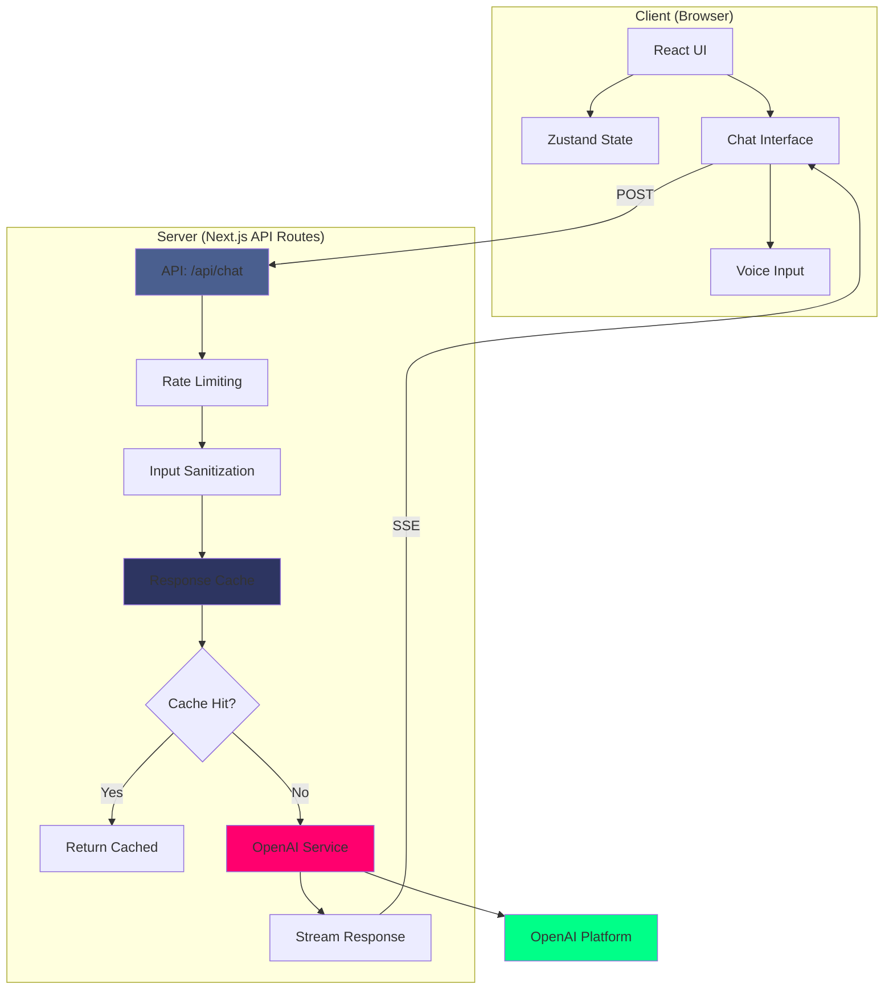
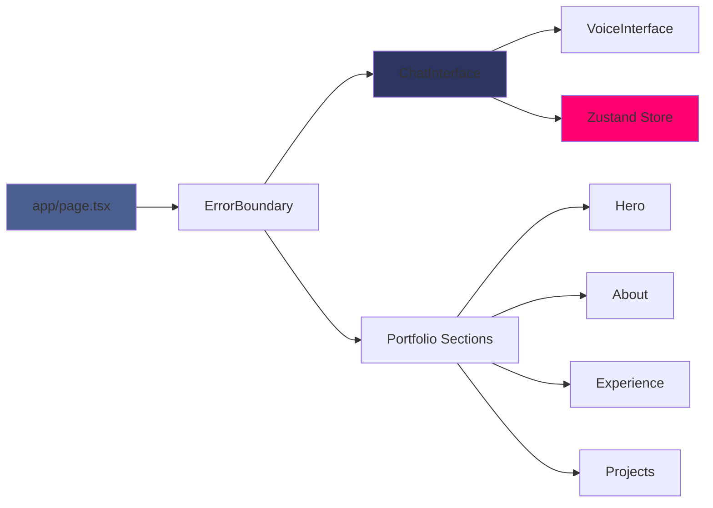

<div align="center">

<!-- Hero Header with Name -->


<br/>

<!-- Animated Typing Subtitle -->


<br/>

<!-- Main Action Buttons -->
<p align="center">
  <a href="https://portfoliozarvis.vercel.app/"></a> <a href="https://github.com/Zacsluss/portfolio_zarvis/archive/refs/heads/main.zip"></a>
</p>

<!-- GitHub Stats Badges -->
<p align="center">
  
  
  
  
  
</p>

</div>

<br/>

---

## 👋 Hey, I'm Zac

I built this portfolio with a conversational AI that knows everything about my professional background. Ask it about my experience, projects, or technical expertise — it responds in real-time with **streaming GPT-4o responses**.

**What makes it interesting:**

- Trained AI assistant with complete career context
- Voice input via OpenAI Whisper API
- Server-side streaming with <500ms TTFB
- 30-50% API cost reduction through intelligent caching
- Rate limiting, error monitoring, and production-ready security

Built with Next.js 14, TypeScript, and OpenAI API!

<div align="center">

<br/>
<i>Real-time conversational AI — ask about my background, projects, or play D&D!</i>
</div>

---

## ⚡ What This Does

<div align="center">

**GPT-4o conversational AI** • **Voice input support** • **Streaming responses** • **Production-ready**

</div>

**Key Features:**

- 🤖 AI assistant trained on complete professional background
- 🎤 Voice input with real-time transcription (Whisper API)
- ⚡ Streaming responses for instant feedback (<500ms TTFB)
- 🎭 Dual personality: Professional consultant or D&D Dungeon Master
- 🔒 Production security: rate limiting, caching, error monitoring

**Tech:** Next.js 14 • TypeScript • GPT-4o • Whisper API • Vercel Edge

---

## 📚 Table of Contents

<details>
<summary><b>Jump to a section</b></summary>

- [🛠️ Tech Stack](#️-tech-stack)
- [🏗️ Architecture](#️-architecture)
- [📊 Performance Benchmarks](#-performance-benchmarks)
- [🚀 Quick Start](#-quick-start)
- [📄 License & Usage](#-license--usage)
- [📬 About & Connect](#-about--connect)

</details>

---

## 🛠️ Tech Stack

<div align="center">

### What I Used to Build This


### Core Dependencies

<table>
<tr>
<td align="center" width="25%">
<br/>
<sub><b>React Framework</b></sub>
</td>
<td align="center" width="25%">
<br/>
<sub><b>Type Safety</b></sub>
</td>
<td align="center" width="25%">
<br/>
<sub><b>AI Models</b></sub>
</td>
<td align="center" width="25%">
<br/>
<sub><b>Styling</b></sub>
</td>
</tr>
</table>

</div>

<details>
<summary><b>📦 See the full dependency list</b></summary>

```json
{
  "dependencies": {
    "next": "^14.2.33",
    "react": "^18.3.1",
    "typescript": "^5.3.3",
    "openai": "^4.87.1",
    "zustand": "^5.0.4",
    "framer-motion": "^11.15.0",
    "tailwindcss": "^3.4.20",
    "@vercel/kv": "^3.0.0",
    "@sentry/nextjs": "^8.47.0"
  },
  "devDependencies": {
    "@playwright/test": "^1.49.1",
    "jest": "^29.7.0",
    "@testing-library/react": "^16.1.0",
    "prettier": "^3.4.2",
    "husky": "^9.1.7"
  }
}
```

**Why these choices?**

- **Next.js 14 App Router**: Server-side API routes protect API keys
- **TypeScript Strict Mode**: Catch bugs before production
- **Streaming responses**: Better perceived performance
- **Vercel KV**: Distributed caching and rate limiting
- **Sentry**: Production error monitoring

</details>

---

## 🏗️ Architecture

<details open>
<summary><b>System Architecture & Data Flow</b></summary>

<br/>

### System Architecture


```mermaid
graph TB
    subgraph "Client (Browser)"
        A[React UI] --> B[Zustand State]
        A --> C[Chat Interface]
        C --> D[Voice Input]
    end

    subgraph "Server (Next.js API Routes)"
        E["API: /api/chat"] --> F[Rate Limiting]
        F --> G[Input Sanitization]
        G --> H[Response Cache]
        H --> I{Cache Hit?}
        I -->|Yes| J[Return Cached]
        I -->|No| K[OpenAI Service]
        K --> L[Stream Response]
    end

    C -->|POST| E
    L -->|SSE| C
    K --> M[OpenAI Platform]

    style E fill:#4a5f8f
    style H fill:#2d3561
    style K fill:#ff006e
    style M fill:#00ff88
```

### Component Hierarchy


```mermaid
graph LR
    App["app/page.tsx"] --> EB[ErrorBoundary]
    EB --> Chat[ChatInterface]
    EB --> Sections[Portfolio Sections]

    Chat --> Voice[VoiceInterface]
    Chat --> State[Zustand Store]

    Sections --> Hero
    Sections --> About
    Sections --> Experience
    Sections --> Projects

    style App fill:#4a5f8f
    style Chat fill:#2d3561
    style State fill:#ff006e
```

</details>

<details>
<summary><b>🔒 Production Features</b></summary>

<br/>

### Security

- ✅ Server-side API key protection (never exposed to client)
- ✅ Rate limiting: 10 requests/min per IP (configurable)
- ✅ Input sanitization and validation
- ✅ Content Security Policy headers
- ✅ Environment variable validation on startup

### Performance

- ✅ Streaming server-sent events (<500ms TTFB)
- ✅ Response caching with 1hr TTL (30-50% cost savings)
- ✅ Vercel KV for distributed caching
- ✅ Edge function deployment
- ✅ Optimized bundle size

### Monitoring

- ✅ Sentry error tracking (client + server)
- ✅ Structured logging with context
- ✅ User-friendly error messages
- ✅ API quota detection and alerts

### Testing

- ✅ 88 passing unit tests with Jest
- ✅ Playwright E2E tests for critical flows
- ✅ 19% test coverage (service layer: 86%+)
- ✅ Automated CI/CD with GitHub Actions

</details>

<details>
<summary><b>📋 Key Design Decisions</b></summary>

<br/>

### Architecture Decision Records

See `docs/adr/` for detailed rationale on key technical decisions:

1. **Server-side API Routes**: Protects API keys, adds ~50-100ms latency
2. **Response Caching Strategy**: 1hr TTL, SHA256 keys, 30-50% cost savings
3. **TypeScript Strict Mode**: 80% bug prevention, slightly slower development

### Design Trade-offs

| Decision               | Rationale                                     | Trade-off                   |
| ---------------------- | --------------------------------------------- | --------------------------- |
| Server-side API routes | Protects OpenAI API key from client exposure  | Adds ~50-100ms latency      |
| Streaming responses    | Improves perceived performance (TTFB <500ms)  | More complex error handling |
| Response caching (1hr) | Reduces API costs 30-50% for common questions | Potential stale data        |
| Vercel KV integration  | Distributed caching across edge nodes         | External dependency         |
| TypeScript strict mode | Catches 80% of bugs before runtime            | Slightly slower development |

</details>

---

## 📊 Performance Benchmarks

<details>
<summary><b>📈 Real production metrics</b></summary>

<br/>

<div align="center">

### Response Times & API Usage

<table align="center">
<tr>
<td width="50%">

#### API Performance

<table>
<tr><th align="center">Metric</th><th align="center">Value</th></tr>
<tr><td align="center">TTFB (streaming)</td><td align="center"><500ms</td></tr>
<tr><td align="center">Full response</td><td align="center">2-5s</td></tr>
<tr><td align="center">Cache hit rate</td><td align="center">~35%</td></tr>
<tr><td align="center">Cost savings</td><td align="center">30-50%</td></tr>
<tr><td align="center">Rate limit</td><td align="center">10 req/min</td></tr>
</table>

</td>
<td width="50%">

#### Test Coverage

<table>
<tr><th align="center">Category</th><th align="center">Coverage</th></tr>
<tr><td align="center">Service Layer</td><td align="center">86%</td></tr>
<tr><td align="center">Error Handling</td><td align="center">91%</td></tr>
<tr><td align="center">Components</td><td align="center">~60%</td></tr>
<tr><td align="center">Overall</td><td align="center">19%</td></tr>
<tr><td align="center">Total Tests</td><td align="center">88 passing</td></tr>
</table>

</td>
</tr>
</table>

</div>

</details>

---

## 🚀 Quick Start

<div align="center">

### Want to try it locally? Takes about 30 seconds

</div>

```bash
git clone https://github.com/Zacsluss/portfolio_zarvis.git && cd portfolio_zarvis && npm install && npm run dev
```

<details>
<summary><b>💻 Local Development Setup</b></summary>

<br/>

**Step-by-step installation:**

```bash
# 1️⃣ Clone this repo
git clone https://github.com/Zacsluss/portfolio_zarvis.git
cd portfolio_zarvis

# 2️⃣ Install dependencies
npm install

# 3️⃣ Set up environment variables
cp .env.example .env.local
# Add your OPENAI_API_KEY to .env.local

# 4️⃣ Start dev server
npm run dev
# Opens at http://localhost:3000
```

**Get your OpenAI API key:**

1. Go to [platform.openai.com/api-keys](https://platform.openai.com/api-keys)
2. Create a new API key
3. Add it to `.env.local`:

```env
OPENAI_API_KEY=sk-your-openai-api-key-here
```

**Available npm scripts:**

- `npm run dev` — Start dev server with hot reload
- `npm run build` — Build for production
- `npm start` — Start production server
- `npm run lint` — Run ESLint
- `npm test` — Run Jest tests with coverage
- `npm run test:e2e` — Run Playwright E2E tests
- `npm run format` — Format code with Prettier

</details>

<details>
<summary><b>🏗️ Production Build & Preview</b></summary>

<br/>

**Build and test locally:**

```bash
# Build optimized production bundle
npm run build

# Preview the production build
npm start
# Opens at http://localhost:3000
```

**Build output:**

- Output folder: `.next/`
- Deployment: Vercel Edge Functions
- Includes: Code splitting, minification, optimization

</details>

<details>
<summary><b>🚀 Deploy to Vercel</b></summary>

<br/>

**One-click deployment:**

[](https://vercel.com/new/clone?repository-url=https://github.com/Zacsluss/portfolio_zarvis)

This will:

1. Clone the repository to your GitHub
2. Set up a Vercel project
3. Prompt you to add `OPENAI_API_KEY` environment variable
4. Deploy to production!

**Manual deployment:**

```bash
# Install Vercel CLI
npm i -g vercel

# Deploy to production
vercel deploy --prod

# Add environment variables
vercel env add OPENAI_API_KEY
```

</details>
<summary><b>🔧 Customize for Yourself</b></summary>

<br/>

**Make it yours (takes about 5 minutes):**

1. **Your content**: Edit `lib/portfolio-data.ts` — swap my info with yours
2. **Your AI personality**: Update `lib/assistant-context.ts` to train on your background
3. **Your style**: Modify `tailwind.config.js` for colors and theme
4. **Your SEO**: Update meta tags in `app/layout.tsx`

**Deploy in 30 seconds:**

```bash
git clone https://github.com/Zacsluss/portfolio_zarvis.git
cd portfolio_zarvis && npm install
vercel deploy --prod
```

</details>

---

## 📄 License & Usage

**MIT License** — Fork it, customize it, do whatever you want with it. No credit needed (but a ⭐ appreciated).

**Quick setup:** \`git clone\` → \`npm install\` → add API key → \`npm run dev\` → \`vercel deploy\`

<details>
<summary><b>📋 Project Structure</b></summary>

<br/>

\`\`\`
portfolio_zarvis/
├── app/ # Next.js App Router
│ ├── api/ # Server-side API routes
│ │ ├── chat/ # Streaming chat endpoint
│ │ ├── transcribe/ # Voice transcription
│ │ └── tts/ # Text-to-speech
│ └── page.tsx # Home page
├── components/ # React components
│ ├── AIAssistant/ # Chat interface
│ ├── sections/ # Portfolio sections
│ └── effects/ # Visual effects
├── lib/ # Core logic
│ ├── services/ # Service layer
│ │ ├── CacheService.ts
│ │ └── RateLimitService.ts
│ ├── portfolio-data.ts # Professional content
│ └── assistant-context.ts # AI training
├── **tests**/ # Jest unit tests
├── e2e/ # Playwright E2E tests
└── docs/adr/ # Architecture Decision Records
\`\`\`

</details>

<br/>

<div align="center">


Full license text in [LICENSE](LICENSE) file.

</div>

---

## 📬 About & Connect

By day, I work as a Lead CRM Systems Analyst managing enterprise Salesforce platforms. By night, I build stuff like this — experimenting with AI, WebGL, and creative tech.

I'm into conversational AI, serverless architecture, shader programming, and building polished user experiences. Always learning, always shipping.

**Let's connect:**

<div align="center">

<a href="https://portfoliozarvis.vercel.app/">
  
</a>
<a href="https://github.com/Zacsluss">
  
</a>
<a href="https://linkedin.com/in/zacharylsluss">
  
</a>
<a href="mailto:zacharyjsluss@gmail.com">
  
</a>
<a href="https://portfoliozarvis.vercel.app/resume.pdf">
  
</a>

<br/>

**Found this helpful?** Give it a ⭐ to show support!

</div>
